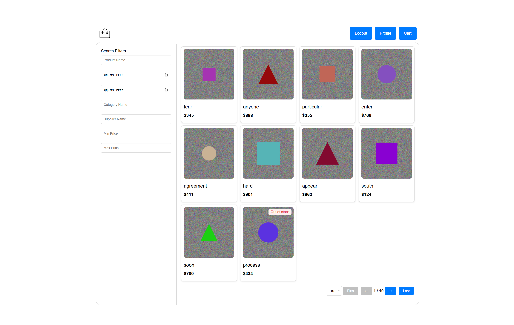
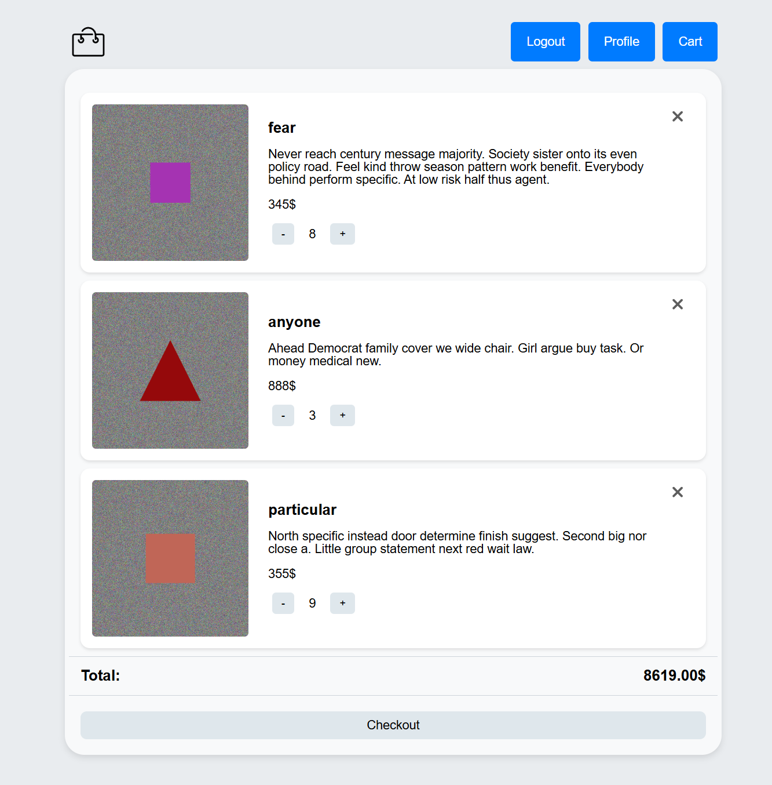
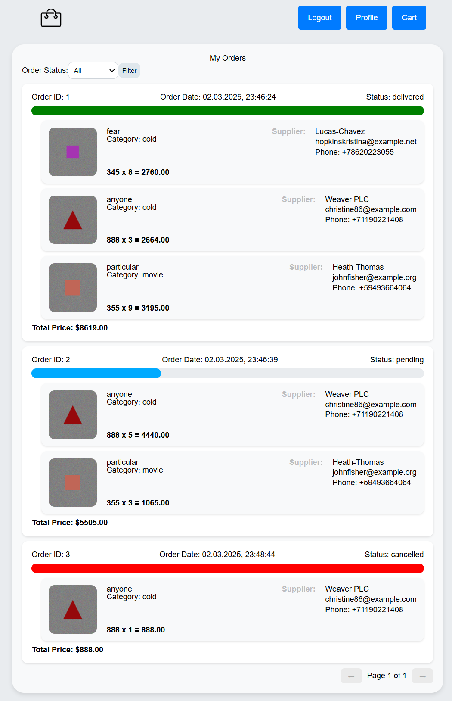
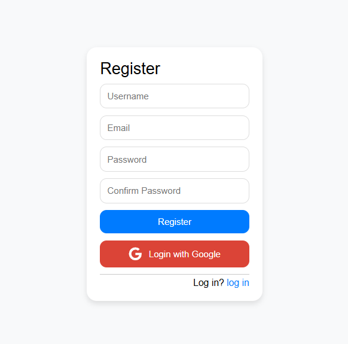
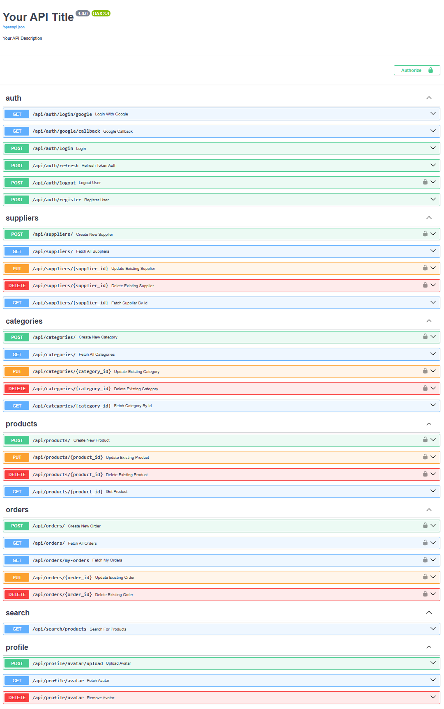

# E-Commerce Product Management

This project provides a convenient platform for browsing, purchasing, and managing products in an online store.

## Key Features

- **FastAPI**: A modern and efficient framework for building RESTful APIs.
- **JWT Authentication**: Secure protected endpoints and manage user sessions.
- **Google OAuth**: Sign in with your Google account for a seamless login experience.
- **MySQL**: Relational database for storing products, orders, and user information.
- **Docker + Docker Compose**: Simplified build and deployment using containers.
- **Swagger**: Automatic documentation (available at `/docs`) for easy testing and integration.

---

## How to Run

1. **Navigate to the project directory**

   ```bash
   cd project/app
   ```

1.1.  **download modules**

   ```git
   git submodule update --init --recursive
   ```

3. **Build and start Docker Compose**

   ```bash
   docker-compose up -d --build
   ```

4. **Seed the database**

   ```bash
   python seeders.py
   ```

5. **Open the application in your browser**
   - The application is available at [http://localhost:4173](http://localhost:4173)
   - API documentation is available at [http://localhost:8000/docs](http://localhost:8000/docs)

---

## Example .env File

Place the `.env` file in the same folder as `docker-compose.yml`:

```
MYSQL_PASSWORD=qwerty
MYSQL_DATABASE=ecom
MYSQL_USER=mysql
MYSQL_HOST=db
MYSQL_PORT=3306
MYSQL_ROOT_PASSWORD=qwerty

VITE_BACKEND_URL=http://localhost:8000
FRONTEND_URL=http://localhost:4173

GOOGLE_REDIRECT_URI=http://localhost:8000/api/auth/google/callback
SESSION_SECRET_KEY=supersecretkey
GOOGLE_CLIENT_ID=your_client_id
GOOGLE_CLIENT_SECRET=your_client_secret
```

> **Note**: Adjust any values as needed to fit your environment.

---

## Technologies Used

- **FastAPI** (Python 3.9+)
- **MySQL**
- **Docker + Docker Compose**
- **JWT (JSON Web Tokens)**
- **Google OAuth**
- **Swagger** for API documentation

---

## Screenshots

Below is a quick preview of the interface (images are displayed at a reduced size):

**Home Page**  


**Cart Page**  


**Profile Page**  


**Register Page**  


**Swagger Documentation**  


---

Enjoy managing and shopping with our E-Commerce Product Management platform!
