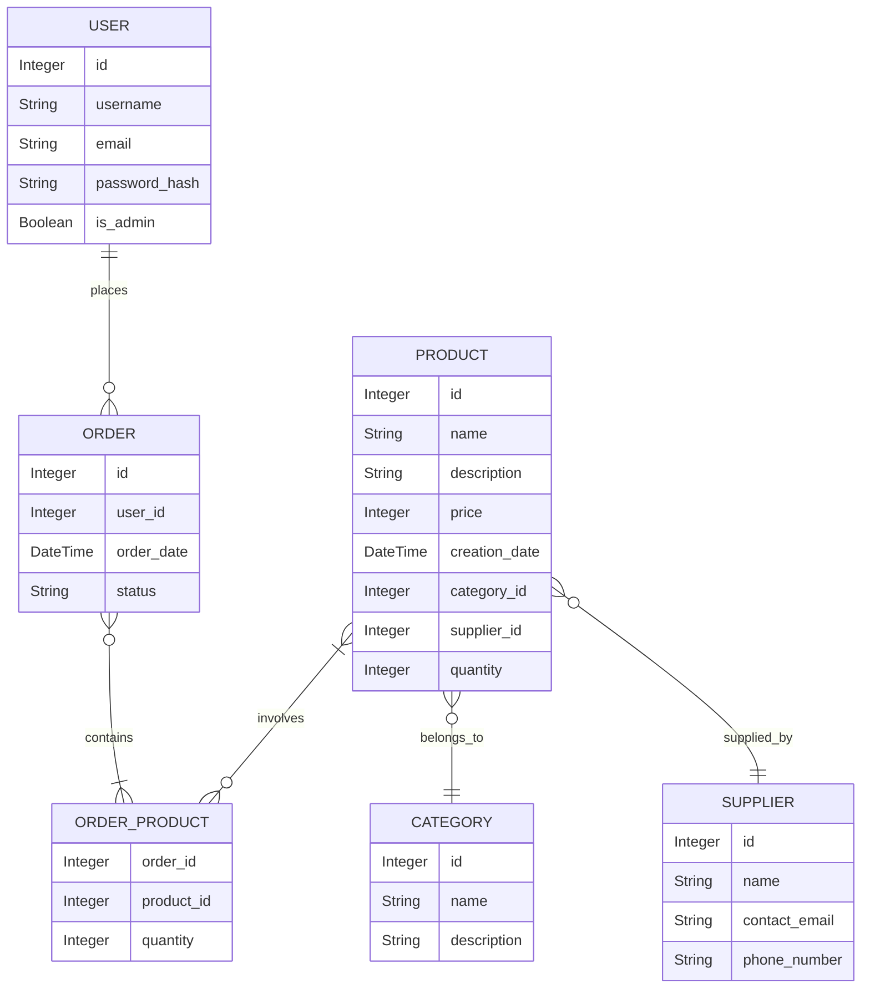
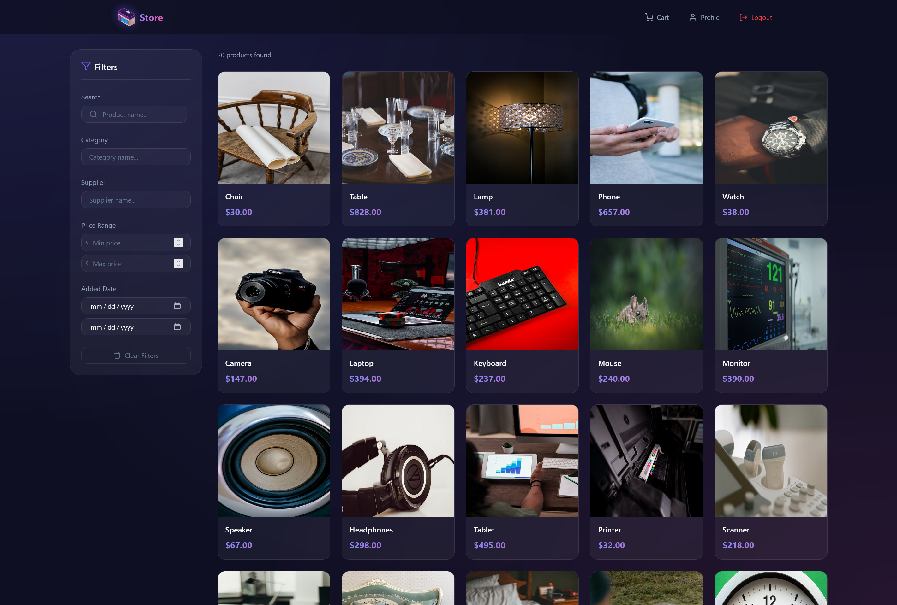
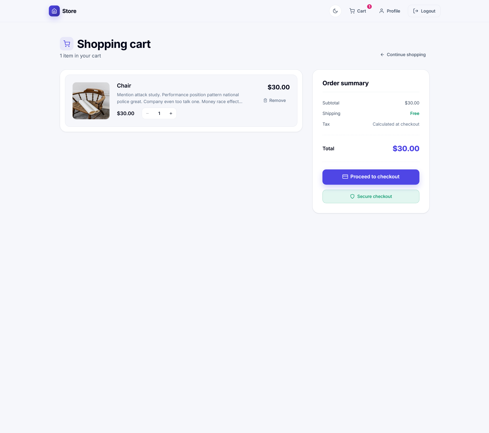
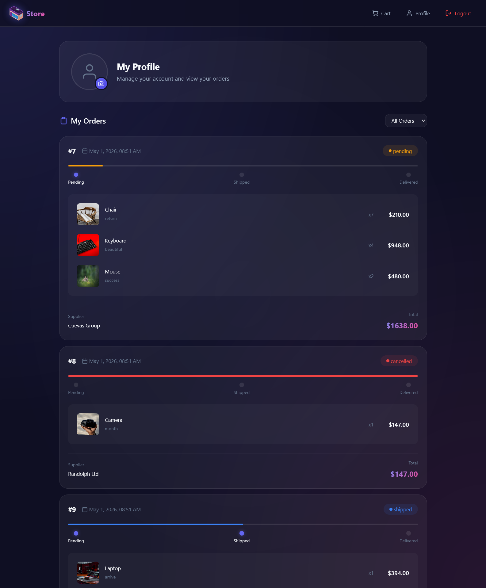
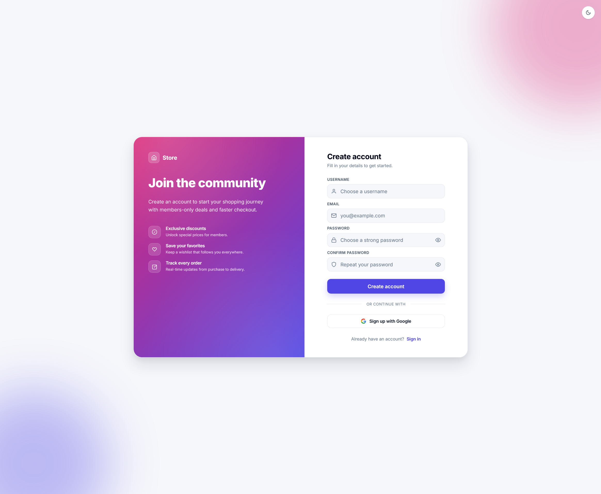

# Store — E-Commerce Platform

A full-stack e-commerce application built with **FastAPI** and **Vue 3**. Browse products, manage your cart, place orders, and track delivery — all wrapped in a modern, responsive interface with **light and dark theme** support.

---

## Features

| Area | Details |
|---|---|
| **Product catalog** | Search by name, category, supplier, price range and date; paginated grid with lazy-loaded images |
| **Shopping cart** | Add / remove items, adjust quantities, real-time stock validation |
| **Order management** | Place orders, track status (Pending → Shipped → Delivered), view history |
| **Authentication** | Email + password (JWT) and Google OAuth 2.0 |
| **User profile** | Upload avatar, filter orders by status |
| **Theming** | Light & dark mode toggle, respects OS preference, persisted to `localStorage` |
| **Responsive** | Fully adaptive from mobile to wide desktop |

---

## Tech Stack

### Backend

- **Python 3.9+** / **FastAPI** — high-performance async REST API
- **MySQL 8.0** — relational data store
- **JWT** — access & refresh token authentication
- **Google OAuth** — social login
- **Swagger / OpenAPI** — auto-generated docs at `/docs`

### Frontend

- **Vue 3** (Composition API) + **TypeScript**
- **Vue Router** — client-side navigation
- **Axios** — HTTP client
- **Tailwind CSS** (config) + custom CSS design system with CSS custom properties
- **Vite** — dev server & build tooling

### Infrastructure

- **Docker** + **Docker Compose** — one-command build & deploy
- **Git Submodules** — backend and frontend as independent repositories

---

## Architecture

```
ecommerce_project/
├── ecom_backend/          # FastAPI backend (submodule)
│   └── project/
│       ├── app/           # Application source
│       ├── Dockerfile
│       └── ...
├── ecom_frontend/         # Vue 3 frontend (submodule)
│   ├── src/
│   │   ├── assets/        # Global CSS design system
│   │   ├── composables/   # useTheme and other composables
│   │   ├── pages/         # Route-level components
│   │   └── router/        # Vue Router config
│   ├── index.html
│   └── package.json
├── pictures/              # Screenshots for README
├── docker-compose.yml
├── db_schema.md           # Mermaid ER diagram
└── README.md
```

---

## Database Schema


```mermaid
erDiagram
    USER {
        Integer id
        String username
        String email
        String password_hash
        Boolean is_admin
    }
    ORDER {
        Integer id
        Integer user_id
        DateTime order_date
        String status
    }
    PRODUCT {
        Integer id
        String name
        String description
        Integer price
        DateTime creation_date
        Integer category_id
        Integer supplier_id
        Integer quantity
    }
    CATEGORY {
        Integer id
        String name
        String description
    }
    SUPPLIER {
        Integer id
        String name
        String contact_email
        String phone_number
    }
    ORDER_PRODUCT {
        Integer order_id
        Integer product_id
        Integer quantity
    }
    USER ||--o{ ORDER : places
    ORDER }o--|{ ORDER_PRODUCT : contains
    PRODUCT }|--o{ ORDER_PRODUCT : involves
    PRODUCT }o--|| CATEGORY : belongs_to
    PRODUCT }o--|| SUPPLIER : supplied_by
```

---

## Getting Started

### Prerequisites

- [Docker](https://www.docker.com/) & Docker Compose
- [Git](https://git-scm.com/)
- (Optional) [Node.js 20+](https://nodejs.org/) for local frontend dev

### 1. Clone the repository

```bash
git clone https://github.com/<your-org>/ecommerce_project.git
cd ecommerce_project
```

### 2. Initialize submodules

```bash
git submodule update --init --recursive
```

### 3. Create the `.env` file

Place it in the project root (next to `docker-compose.yml`):

```env
# MySQL
MYSQL_PASSWORD=qwerty
MYSQL_DATABASE=ecom
MYSQL_USER=mysql
MYSQL_HOST=db
MYSQL_PORT=3306
MYSQL_ROOT_PASSWORD=qwerty

# URLs
VITE_BACKEND_URL=http://localhost:8000
FRONTEND_URL=http://localhost:4173

# Google OAuth
GOOGLE_REDIRECT_URI=http://localhost:8000/api/auth/google/callback
SESSION_SECRET_KEY=supersecretkey
GOOGLE_CLIENT_ID=your_client_id
GOOGLE_CLIENT_SECRET=your_client_secret
```

> Adjust values as needed for your environment. Never commit real secrets.

### 4. Build & start

```bash
docker-compose up -d --build
```

### 5. Seed the database

```bash
python seeders.py
```

### 6. Open in your browser

| Service | URL |
|---|---|
| Frontend | [http://localhost:4173](http://localhost:4173) |
| API docs (Swagger) | [http://localhost:8000/docs](http://localhost:8000/docs) |

---

## Screenshots

> The app supports **light** and **dark** themes. Toggle with the sun/moon button in the navigation bar.

<table>
  <tr>
    <td align="center"><strong>Home Page</strong></td>
    <td align="center"><strong>Cart Page</strong></td>
  </tr>
  <tr>
    <td></td>
    <td></td>
  </tr>
  <tr>
    <td align="center"><strong>Profile Page</strong></td>
    <td align="center"><strong>Register Page</strong></td>
  </tr>
  <tr>
    <td></td>
    <td></td>
  </tr>
</table>

---

## API Endpoints (highlights)

| Method | Endpoint | Description |
|---|---|---|
| `POST` | `/api/auth/register` | Register a new user |
| `POST` | `/api/auth/login` | Login (returns JWT) |
| `GET` | `/api/auth/login/google` | Redirect to Google OAuth |
| `POST` | `/api/auth/refresh` | Refresh access token |
| `GET` | `/api/search/products` | Search & filter products |
| `GET` | `/api/products/{id}` | Product details |
| `POST` | `/api/orders/` | Place an order |
| `GET` | `/api/orders/my-orders` | User order history |
| `POST` | `/api/profile/avatar/upload` | Upload profile avatar |
| `GET` | `/api/categories/{id}` | Category info |
| `GET` | `/api/suppliers/{id}` | Supplier info |

Full interactive documentation is available at **[/docs](http://localhost:8000/docs)** when the backend is running.

---

## License

This project is provided for educational purposes.
